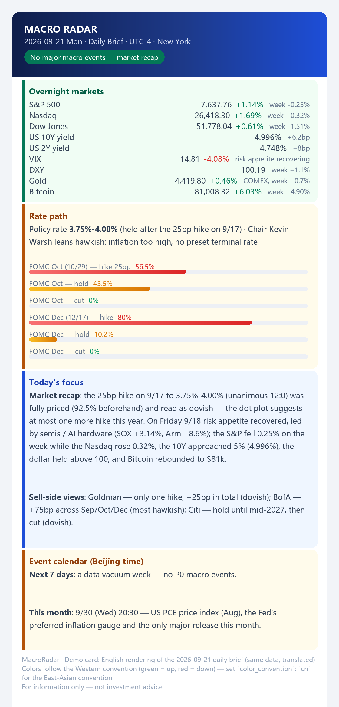

# macro-radar

**English** · [中文](README.zh-CN.md)

**An AI-agent-driven macro event sentinel with deterministic delivery.**
Tracks Fed events (FOMC / CPI / NFP / PCE) and pushes card-style briefs to subscribers —
email first, WeChat (PushPlus) optional in China.
`AI agents` · `automation` · `macro` · `market-data` · `notification-pipeline`



## Why this repo is worth a look

**The conclusion first: research may be fuzzy, delivery must be exact.** Everything here
follows from that one sentence — including the rule that *silence is a valid state*
(no event tomorrow → send nothing).

Most "AI automation" projects either let the model do everything (including the
part that must never be fuzzy) or keep the AI out entirely. This one draws a hard
line through the middle:

| | Research leg | Delivery leg |
|---|---|---|
| Nature | open-ended search + judgment | deterministic execution |
| Tool | AI agent under **five hard rules** | templates + a 159-line script |
| Cost of failure | a wrong sentence (correctable, attributable) | wrong recipient / missed / duplicate send (not recallable) |
| Design target | coverage + honesty | predictability + auditability |

## Quick start (no keys, no network)

```bash
python demo/render_card.py --all
# daily-en.json  ->  demo/output/daily-en.html  (7038 bytes, locale=en)
# daily-zh.json  ->  demo/output/daily-zh.html  (7092 bytes, locale=zh)

python scripts/send.py --html demo/output/daily-en.html --dry-run
# {"ok": true, "dry_run": true, "html_bytes": 7038, ...}   ← validates the pipeline, sends nothing
```

Real send (fill `config/smtp.json` and `data/subscribers.csv` first — on Windows use `copy`):

```bash
cp config/smtp.example.json config/smtp.json
cp data/subscribers.example.csv data/subscribers.csv
# dry-run first — resolves recipients from the CSV without sending:
python scripts/send.py --html demo/output/daily-en.html \
  --subscribers data/subscribers.csv --channel daily --dry-run
# then for real:
python scripts/send.py --title "MacroRadar · daily" --html demo/output/daily-en.html \
  --subscribers data/subscribers.csv --channel daily
```

Subscriber filtering lives in `scripts/send.py`: blank rows skipped, `status=enabled`,
`channels` must contain the channel you pass, token → WeChat group, email → mail group.
**An empty `channels` cell means "opted out of everything"** — blank is never treated as "all".

Python 3.8+, **standard library only** — no pip install, nothing to build.
(The optional `--iana` timezone mode additionally wants a tz database: see below.)

**Deploying with an AI agent?** [`AGENTS.md`](AGENTS.md) is the machine-readable contract:
the two commands that prove the repo is healthy (with expected byte counts), the five
questions an agent must ask before touching anything, and a failure-mode table.

**Two ways in.**

**Path A — you just want to use it.** Change nothing. Read `docs/` in order:
[01 architecture](docs/01-architecture.md) → [02 design system](docs/02-design-system.md) →
[03 AI research discipline](docs/03-ai-research-discipline.md) →
[04 delivery and deployment](docs/04-delivery-and-deployment.md). Then put your own hours in
your scheduler; for real sending, follow the block above.

**Path B — you want to change it.** Plain Python, standard library only: no build step,
nothing to install. Edit a template or a script and re-run the first command above — note that
the rendered cards in `demo/output/` are git-visible results, so they show up in your diff.
If you are an AI agent working here, read [`AGENTS.md`](AGENTS.md) first; it is the contract.

## Make it yours — timezone, colours, schedule

Defaults are set for a Chinese reader (Beijing time, red-up). Three things change per reader,
and **all three are data, not code**:

| What | Where | Default | For a US/Europe reader |
|---|---|---|---|
| **Colour convention** | fixture `"color_convention"` | `auto` → red-up for `zh`, green-up for `en` | green-up. East Asia (China incl. HK/Macao/Taiwan, Japan, Korea) = red-up; US/Europe = green-up — **same numbers, opposite meaning** |
| **Timezone shown on the card** | fixture `"timezone_label"` | `UTC+8 · Beijing` | e.g. `UTC-4 · New York`, rendered in the card header so nobody misreads the clock |
| **When briefs fire** | your scheduler (local time) | Beijing 07:00 / 09:00 / Sat 09:00 | set your own local hours — no code change |

```bash
python tools/tz_convert.py --verify                    # calendar integrity: 105/105 consistent (real run)
python tools/tz_convert.py --utc-offset -4 --events    # upcoming events on your clock
python tools/tz_convert.py --utc-offset 1  --plan      # flags 00:00/02:00 local and suggests fixes
```

Why this matters: US releases are anchored to **Eastern time** (08:30 / 10:30 / 14:00 ET).
The 2026-09-30 PCE lands at 20:30 in Beijing, 08:30 in New York, 13:30 in London — and an
FOMC decision at 14:00 ET is **02:00 next day in Beijing**, which is exactly why the
"T-1 brief" product exists. Details in [docs/04](docs/04-delivery-and-deployment.md).

## What's inside

**Four products**, each with an explicitly defined scope so they never overlap:

| Product | Schedule | Fires when | Job |
|---|---|---|---|
| Daily brief | weekdays 07:00 *(Beijing)* | always | overnight markets + rate path + today/this-week events + sell-side views |
| T-1 event brief | weekdays 09:00 *(Beijing)* | only if a P0 event is tomorrow (**silent otherwise**) | single-event dossier: three scenarios, key levels |
| Data flash | event release +30min *(anchored to ET)* | only on CPI/NFP/PCE days | actual vs consensus vs prior + hawkish/dovish call |
| Weekly summary | Saturdays 09:00 *(Beijing)* | always | week in review + rate-path tracking (+ a shift alert if probabilities moved >10pp) |

Times above are the production settings; your own hours go in your scheduler — see *Make it yours*.

**A design system with opinions** — 520px cards, four semantic tones
(`alert #dc2626` / `warn #b45309` / `good #047857` / `info #1d4ed8`),
FedWatch probability bars as red/amber/green gradients, and
**red-up / green-down** (Chinese convention) applied consistently to every asset class.
Details in [docs/02](docs/02-design-system.md).

**Real sample outputs** in [`samples/`](samples/) — these are actual production
cards (dates 2026-09), not mockups: a daily brief, a data flash, a T-1 brief
and a weekly summary.

## The AI research leg (the interesting part)

The research half is an AI agent that reads public sources and fills the card.
Its rules are structural, not vibes:

1. **Actual ≠ consensus.** Filling the consensus number into the "actual" slot is
   the single worst failure mode; if the release is late, the card says so.
2. **Unknown has a representation.** Missing data is written as `未获取`
   (the Chinese for "not retrieved") — never estimated, never left blank.
3. **No unfalsifiable language.** No `≈`, no "roughly", no stand-alone
   "weakening" — give the number, the level, or the delta.
4. **Every number carries its source** (Fed / BLS / BEA / CME FedWatch / Reuters / Bloomberg).
5. **Framework, not advice.** Three scenarios and their implications; no
   buy/sell calls, no position sizing. A sentinel reports, it doesn't recommend.

How they're enforced (and why "please be accurate" in a prompt is not enough):
[docs/03](docs/03-ai-research-discipline.md).

## Repository layout

```
├── AGENTS.md                  # machine-readable deployment contract (for AI agents)
├── demo/
│   ├── render_card.py         # fixture JSON -> card HTML (zero deps, zh/en, red-up/green-up)
│   ├── fixtures/              # sample data (same numbers as a real 2026-09 brief)
│   └── output/                # generated cards (git-visible results)
├── templates/                 # the design system: daily / t1 / card (shared) / weekly
├── scripts/send.py            # delivery: email (SMTP) + PushPlus + subscriber CSV, with --dry-run
├── tools/build_calendar.py    # event-calendar builder
├── tools/tz_convert.py        # timezone conversion, schedule fit check, calendar integrity
├── data/                      # calendar.json, fedwatch_history.json, subscribers.example.csv
├── config/smtp.example.json   # SMTP config template
├── samples/                   # four real production cards
└── docs/                      # 01 architecture · 02 design system · 03 AI discipline · 04 delivery
```

## What is deliberately NOT in this repo

Publishing a *running* personal system means proving what was removed:

- no SMTP credentials, no PushPlus tokens (config templates only);
- no subscriber identities, no email addresses;
- no server paths, hostnames or deployment links;
- no personal names anywhere in templates or docs.

The live system keeps its own `config/smtp.json` and subscriber list locally;
what you see here is the engine with the operator taken out.

## Related projects — and what this repo does **not** claim

This is a running system published for its architecture and method, not a library.
Before claiming anything for ourselves, here is what already exists — and note that
**this repo depends on none of them** (verified 2026-09):

| Layer | Established solution | What we do instead |
|---|---|---|
| FedWatch probabilities | [`pyfedwatch`](https://github.com/ARahimiQuant/pyfedwatch) — 55★, Apache-2.0, Python implementation of the CME FedWatch tool | our data leg is an AI agent reading public sources ([docs/03](docs/03-ai-research-discipline.md)) — a deliberate trade-off, not an oversight |
| Economic-calendar parsing | [`forex_factory_calendar_news_scraper`](https://github.com/fizahkhalid/forex_factory_calendar_news_scraper) — 103★, MIT | we keep a hand-curated `data/calendar.json` (only the events that move markets, with Beijing-time labels); take the scraper if you want full coverage |
| Multi-channel push | [`push-all-in-one`](https://github.com/CaoMeiYouRen/push-all-in-one) — 211★, MIT (Server酱 / DingTalk / Bark / email …) | we call SMTP and PushPlus directly, in 159 lines of `scripts/send.py`; take the SDK if you need more channels |
| Workflow automation | n8n templates, e.g. [`awesome-n8n-templates`](https://github.com/enescingoz/awesome-n8n-templates) — 25k★ | we schedule with the host platform; take n8n if you want a visual editor |

**Zero third-party dependencies.** `demo/render_card.py` and `scripts/send.py` import only the
standard library (`argparse`, `json`, `os`, `sys`, `datetime`, `email.*`, `pathlib`) — so the
delivery leg stays reproducible anywhere, indefinitely.

The closest work we found: [`US_Treasury_Daily_Report_Skill`](https://github.com/BVBllf/US_Treasury_Daily_Report_Skill)
(9★, MIT, active) — an AI-assistant skill that collects Treasury yields, FedWatch probabilities and
macro data into a daily report. Same raw material, different shape: **one report generated on demand**
versus **four scheduled products with subscriber fan-out, delivery guarantees and a design system**.

So what *is* rare here?

1. **An AI research leg with five written hard rules** — "unknown" is a first-class value
   (`未获取`), actual is never confused with consensus, every number carries a source ([docs/03](docs/03-ai-research-discipline.md)).
2. **The architectural split** between fuzzy research and exact delivery: *research may be fuzzy,
   delivery must be exact* ([docs/01](docs/01-architecture.md)). In the generic AI-automation space
   this boundary is usually absent — the agent decides everything.
3. **Silence is a valid state** — no event tomorrow means nothing is sent, and the four products have
   non-overlapping scopes so no event is ever pushed twice.
4. **A real system with sanitisation evidence** — `samples/` are production cards, and the list of
   what was deliberately removed is published next to them.

If you need a library — probabilities, parsing, pushing — take the projects above; they are better at
it than this repo is. What you can borrow *here* is the shape of the system.

**A useful criterion for whether this repo is for you:** do you need the *shape* of a system — a fuzzy
research half fenced by written rules, plus an exact, auditable delivery half — or do you need a library
that computes FedWatch probabilities, parses economic calendars and fans out messages? If it is the
second one, use the projects above and skip this one.

## Docs

| Doc | Content |
|---|---|
| [01](docs/01-architecture.md) | architecture: two halves, four tracks, single source of truth |
| [02](docs/02-design-system.md) | design tokens, semantic colours, red-up/green-down, fixture schema |
| [03](docs/03-ai-research-discipline.md) | the five hard rules for the AI research leg |
| [04](docs/04-delivery-and-deployment.md) | email-first delivery, PushPlus setup (China), deployment pitfalls |

## More from this author

Three repositories, one theme — don't lie to yourself:

- [backtest-honesty](https://github.com/Roy9608/backtest-honesty) — 14 checks before you trust a positive backtest
- [live-trading-bot-reliability](https://github.com/Roy9608/live-trading-bot-reliability) — reliability playbook for AI-coded trading bots
- [blackbox-indicator-reverse](https://github.com/Roy9608/blackbox-indicator-reverse) — reverse-engineering black-box market indicators

## Language note

Docs and templates are written in Chinese (the product serves Chinese-speaking
readers); both READMEs are bilingual, and `demo/render_card.py` renders cards in
either locale.

## License

MIT
