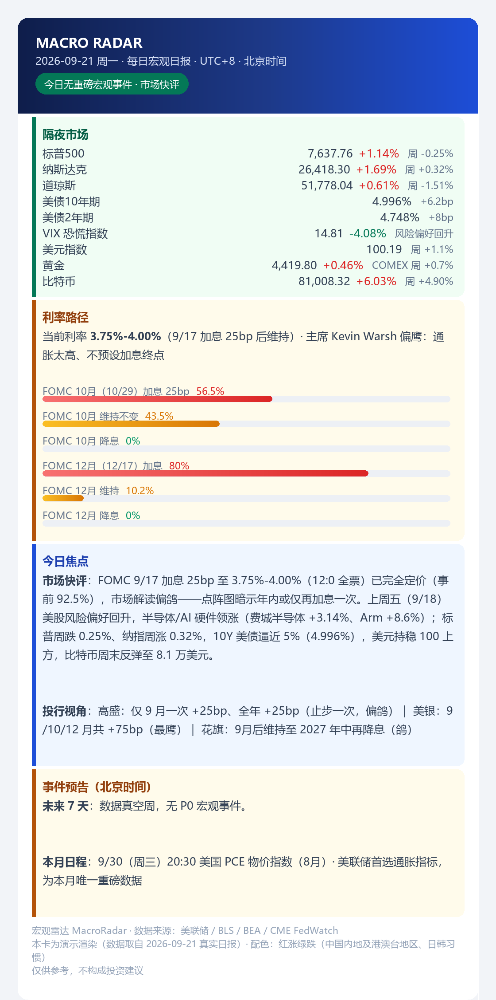

# macro-radar

**AI 研究员 + 确定性分发：一个真实在跑的美联储宏观事件哨兵。**
跟踪 FOMC / CPI / NFP / PCE，把研究结论渲染成卡片推送给订阅者——邮件为主，
中国境内可选微信（PushPlus）。
`AI agents` · `automation` · `macro` · `market-data` · `notification-pipeline`



## 这个仓库值得看一眼的地方

大多数"AI 自动化"项目要么让模型包办一切（包括那些绝不能含糊的部分），
要么干脆不用 AI。这个项目在中间画了一条硬线：

| | 研究半场 | 分发半场 |
|---|---|---|
| 本质 | 开放式检索 + 判断 | 确定性执行 |
| 工具 | AI Agent（受**5 条反编造硬规则**约束） | 模板 + 106 行脚本 |
| 失效代价 | 一句话写错（可修正、可溯源） | 发错人 / 漏发 / 重复发（不可撤回） |
| 设计目标 | 覆盖 + 诚实 | 可预测 + 可复核 |

**研究可以模糊，分发必须精确。** 整套设计都是这一句话的推论——
包括"**静默是合法状态**"（明天没事件就不发）。

## 快速开始（无需密钥、无需联网）

```bash
python demo/render_card.py --all
# daily-en.json  ->  demo/output/daily-en.html  (7038 bytes, locale=en)
# daily-zh.json  ->  demo/output/daily-zh.html  (7092 bytes, locale=zh)

python scripts/send.py --html demo/output/daily-en.html --dry-run
# {"ok": true, "dry_run": true, "html_bytes": 7038, ...}   ← 校验链路，不实际发送
```

真实发送（先填 `config/smtp.json` 与 `data/subscribers.csv`；Windows 下 `cp` 换成 `copy`）：

```bash
cp config/smtp.example.json config/smtp.json
cp data/subscribers.example.csv data/subscribers.csv
# 先 dry-run —— 从 CSV 解析收件人，但不发送：
python scripts/send.py --html demo/output/daily-zh.html \
  --subscribers data/subscribers.csv --channel daily --dry-run
# 确认无误后真发：
python scripts/send.py --title "MacroRadar · 日报" --html demo/output/daily-zh.html \
  --subscribers data/subscribers.csv --channel daily
```

订阅过滤在 `scripts/send.py` 里：跳过空行 → `status=enabled` → `channels` 含你传入的频道 →
有 token 进微信组、有邮箱进邮件组。**`channels` 留空 = 未订阅任何频道**（空不等于"全部"）。

Python 3.8+，**纯标准库**——不装依赖、没有构建步骤（可选的 `--iana` 时区模式另外需要 tz 数据库）。

**用 AI Agent 部署？** [`AGENTS.md`](AGENTS.md) 是机器可读的契约：两条证明仓库健康的命令
（含预期字节数）、动手前必须问清的五个问题、以及失败模式对照表。

## 改成你自己的 —— 时区 / 配色 / 作息

默认值是给中文读者设的（北京时间、红涨绿跌）。对非中文读者有三处要改，
**三处都是数据，不是代码**：

| 项 | 位置 | 默认 | 美欧读者 |
|---|---|---|---|
| **涨跌配色** | fixture 的 `"color_convention"` | `auto` → zh 红涨绿跌 / en 绿涨红跌 | 绿涨红跌。中国内地及港澳台地区、日本、韩国 = 红涨绿跌；美国、欧洲 = 绿涨红跌——**同一组数字，含义相反** |
| **卡片上的时区** | fixture 的 `"timezone_label"` | `UTC+8 · 北京时间` | 如 `UTC-4 · New York`，渲染在卡片头部，避免读者误读时钟 |
| **产品触发时刻** | 你的调度器（本地时间） | 北京 07:00 / 09:00 / 周六 09:00 | 换成你的本地时刻，**无需改代码** |

```bash
python tools/tz_convert.py --verify                    # 日历自洽性：实测 105/105 一致
python tools/tz_convert.py --utc-offset -4 --events    # 未来事件在我这里的时刻
python tools/tz_convert.py --utc-offset 1  --plan      # 标出 00:00/02:00 这类偏离作息的时刻并给建议
```

为什么必须考虑：美国数据锚定**美东时间**（08:30 / 10:30 / 14:00 ET）。
2026-09-30 的 PCE 在北京是 20:30、纽约 08:30、伦敦 13:30；
而 FOMC 决议美东 14:00 = **北京时间次日 02:00**——这正是「T-1 事件提醒」这个产品存在的理由。
细节见 [docs/04](docs/04-delivery-and-deployment.md)。

## 仓库里有什么

**四条产品线**，职责边界被显式定义过，永不重叠：

| 产品 | 调度 | 触发条件 | 职责 |
|---|---|---|---|
| 每日宏观日报 | 工作日 07:00 *（北京）* | 每天必发 | 隔夜市场 + 利率路径 + 今日/本周事件 + 投行视角 |
| T-1 事件提醒 | 工作日 09:00 *（北京）* | 明天有 P0 事件才发（**否则静默**） | 单事件档案：三种情景 + 关键看点 |
| 晚间数据快报 | 发布后 +30min *（锚定美东）* | 仅 CPI/NFP/PCE 日 | 实际 vs 预期 vs 前值 + 鹰鸽判定 |
| 每周摘要 | 周六 09:00 *（北京）* | 每周必发 | 周度回顾 + 利率路径（概率变动 >10pp 额外推「利率突变提醒」） |

上表是生产环境的设置；你自己的时刻填进调度器即可，见上面的「改成你自己的」。

**一套有主见的设计系统**——520px 卡片、四态语义色
（`alert #dc2626` / `warn #b45309` / `good #047857` / `info #1d4ed8`）、
FedWatch 概率条三色渐变、以及**红涨绿跌**（中国习惯）统一应用于所有资产类别。
细节见 [docs/02](docs/02-design-system.md)。

**真实产出样张** 在 [`samples/`](samples/)——是真实生产卡片（2026-09），不是假样：
日报 / 数据快报 / T-1 简报 / 周报摘要各一份。

## AI 研究员那一半（最有意思的部分）

研究半场是一个 AI Agent：读公开信息源，把数据填进卡片。它的规则是**结构性**的，不靠语气：

1. **实际值 ≠ 预期值**：把 consensus 填进 actual 槽是最严重的失效；数据未发布就如实标注。
2. **未知有表示法**：拿不到就写「未获取」，不许估、不许留空。
3. **禁止不可证伪的措辞**：没有 `≈`、没有"大约"、没有孤立的"走弱"——给数字、给点位、给变化量。
4. **每个数值带来源**（美联储 / BLS / BEA / CME FedWatch / 路透 / 彭博）。
5. **给框架，不给建议**：三种情景及其含义，不写买卖、不给仓位。哨兵只报送，不推荐。

这些规则怎么落地（以及为什么提示词里的"请注意准确"不算数）：
[docs/03](docs/03-ai-research-discipline.md)。

## 目录结构

```
├── AGENTS.md                  # 机器可读的部署契约（给 AI Agent 用）
├── demo/
│   ├── render_card.py         # fixture JSON -> 卡片 HTML（零依赖，中英双语，红涨/绿涨可切）
│   ├── fixtures/              # 示例数据（数值取自真实的 2026-09 日报）
│   └── output/                # 渲染产物
├── templates/                 # 设计系统：daily / t1 / card（共用）/ weekly
├── scripts/send.py            # 分发：邮件（SMTP）+ PushPlus + 订阅名单 CSV，含 --dry-run
├── tools/build_calendar.py    # 事件日历构建
├── tools/tz_convert.py        # 时区换算 / 作息契合检查 / 日历自洽性校验
├── data/                      # calendar.json、fedwatch_history.json、订阅表示例
├── config/smtp.example.json   # SMTP 配置模板
├── samples/                   # 四份真实生产卡片
└── docs/                      # 01 架构 · 02 设计系统 · 03 AI 纪律 · 04 分发与部署
```

## 这个仓库里**故意没有**的东西

发布一个**真实在跑的个人系统**，就必须证明删掉了什么：

- 无 SMTP 凭据、无 PushPlus token（只有配置模板）；
- 无订阅者身份、无任何邮箱地址；
- 无服务器路径、主机名、部署链接；
- 模板与文档里无任何个人姓名。

生产系统保留着自己的本地 `config/smtp.json` 与订阅名单；
这里是你看到的**摘掉运营者的引擎**。

## 相关项目 —— 以及这个仓库**不**声称的东西

这是一个为了公开**架构与方法**而发布的生产系统，不是一个库。在给自己记功之前，
先看现成的东西——注意：**本仓库不依赖下列任何一个**（核实于 2026-09）：

| 层次 | 现成方案 | 我们的做法 |
|---|---|---|
| FedWatch 概率 | [`pyfedwatch`](https://github.com/ARahimiQuant/pyfedwatch) —— 55★，Apache-2.0，CME FedWatch 工具的 Python 实现 | 数据腿是 AI Agent 读公开信息（[docs/03](docs/03-ai-research-discipline.md)）——这是**刻意的取舍**，不是没查到 |
| 经济日历解析 | [`forex_factory_calendar_news_scraper`](https://github.com/fizahkhalid/forex_factory_calendar_news_scraper) —— 103★，MIT | 我们手工维护 `data/calendar.json`（只留有市场影响力的事件，标注北京时间）；要全量覆盖就用那个爬虫 |
| 多通道推送 | [`push-all-in-one`](https://github.com/CaoMeiYouRen/push-all-in-one) —— 211★，MIT（Server酱 / 钉钉 / Bark / 邮件…） | 我们用 `scripts/send.py` 的 106 行直接调 SMTP 与 PushPlus；要更多通道就用那个 SDK |
| 工作流自动化 | n8n 模板，如 [`awesome-n8n-templates`](https://github.com/enescingoz/awesome-n8n-templates) —— 25k★ | 我们用宿主平台调度；要可视化编排就用 n8n |

**零第三方依赖。** `demo/render_card.py` 与 `scripts/send.py` 只 import 标准库
（`argparse`、`json`、`os`、`sys`、`datetime`、`email.*`、`pathlib`）——
这样分发半场在任何机器、任何时间都能复现。

我们找到的**最近邻**：[`US_Treasury_Daily_Report_Skill`](https://github.com/BVBllf/US_Treasury_Daily_Report_Skill)
（9★，MIT，活跃）——一个给 AI 助手用的 skill：采集美债收益率、FedWatch 概率与宏观数据，生成日报。
同一批原料，不同的形态：**按需生成的一份日报** vs **四条定时产品线 + 订阅分发 + 交付判据 + 设计系统**。

那么这个仓库里**真正稀有**的是什么？

1. **带成文反编造规则的 AI 研究腿**——"未知"是一等公民（`未获取`）、实际值绝不与预期值混淆、
   每个数值都带来源（[docs/03](docs/03-ai-research-discipline.md)）。
2. **"研究可模糊、分发必须确定"的架构切分**（[docs/01](docs/01-architecture.md)）。
   在泛 AI 自动化领域，这条边界通常是缺失的——让 agent 决定一切。
3. **静默是合法状态**——明天没有事件就什么都不发；四条产品线职责不重叠，同一事件永不被推两次。
4. **真实运行 + 脱敏证据**——`samples/` 是生产卡片，"故意删除清单"就登在它旁边。

如果你要的是一个库（概率、解析、推送），请用上面那些项目——它们比本仓库做得更好。
你**能从这里拿走**的，是系统的形状。

## 文档

| 文档 | 内容 |
|---|---|
| [01](docs/01-architecture.md) | 架构：两个半场、四条线、单一事实源 |
| [02](docs/02-design-system.md) | 设计令牌、语义色、红涨绿跌、fixture schema |
| [03](docs/03-ai-research-discipline.md) | AI 研究员的五条硬规则 |
| [04](docs/04-delivery-and-deployment.md) | 邮件优先分发、PushPlus 配置教程、部署坑清单 |

## 同作者的其他仓库

三个仓库，同一个主题——别骗自己：

- [backtest-honesty](https://github.com/Roy9608/backtest-honesty) —— 回测出正收益前必过的 14 条检查
- [live-trading-bot-reliability](https://github.com/Roy9608/live-trading-bot-reliability) —— AI/vibe coding 写交易 bot 的可靠性手册
- [blackbox-indicator-reverse](https://github.com/Roy9608/blackbox-indicator-reverse) —— 黑盒市场指标口径反推

## 语言说明

文档与模板为中文（产品服务中文读者）；两份 README 双语；
`demo/render_card.py` 支持中英两种 locale 渲染。

## 许可

MIT
